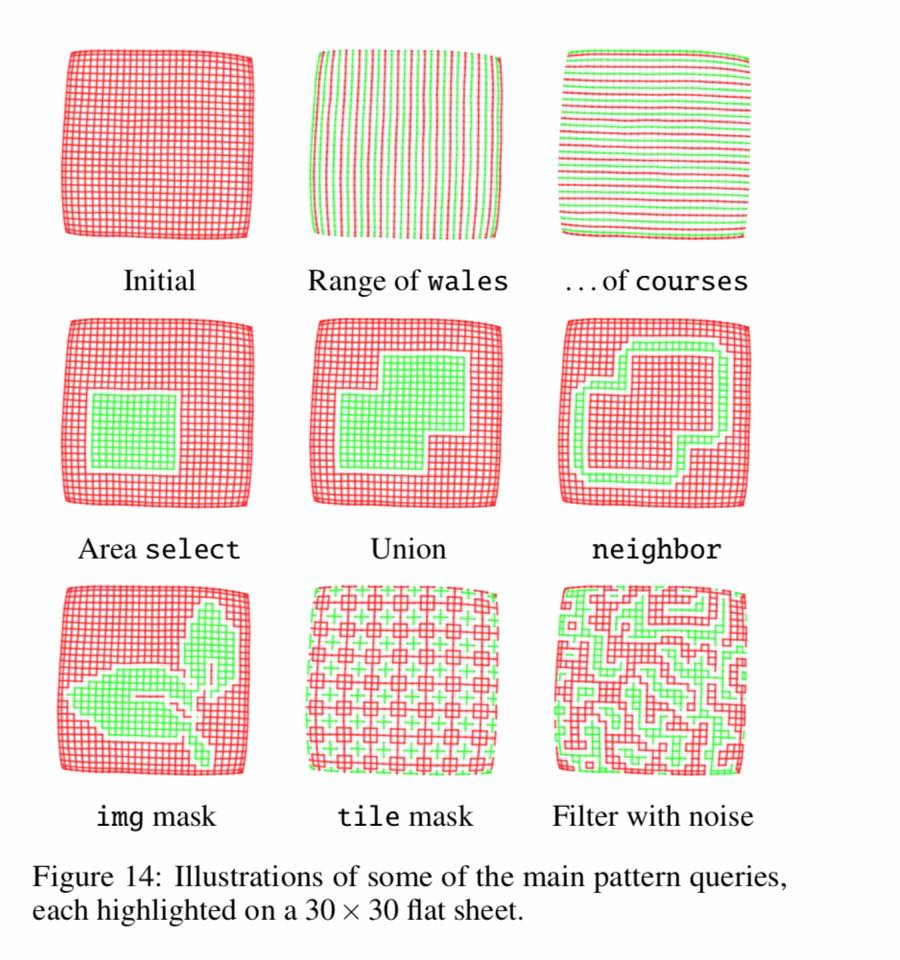
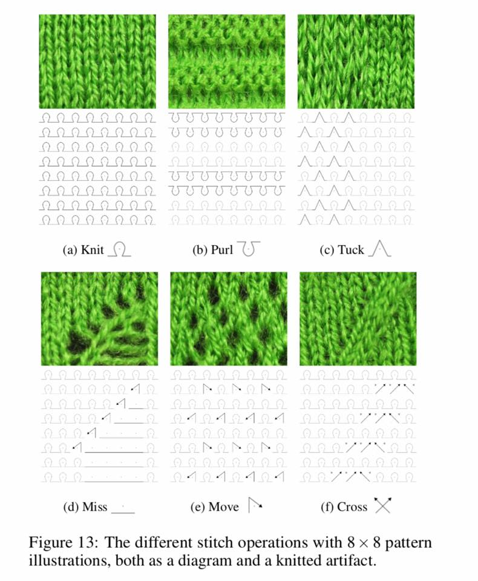
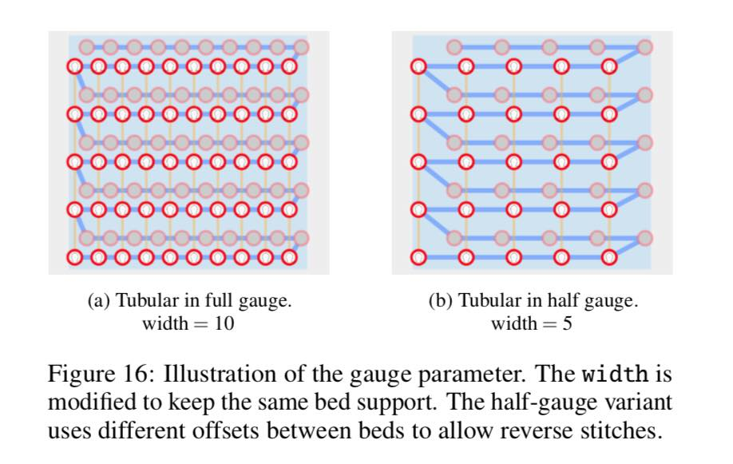
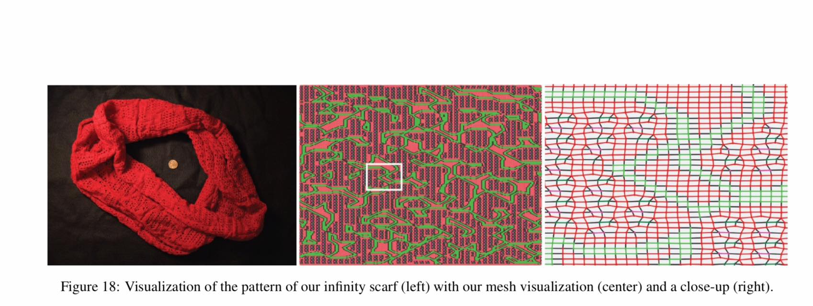
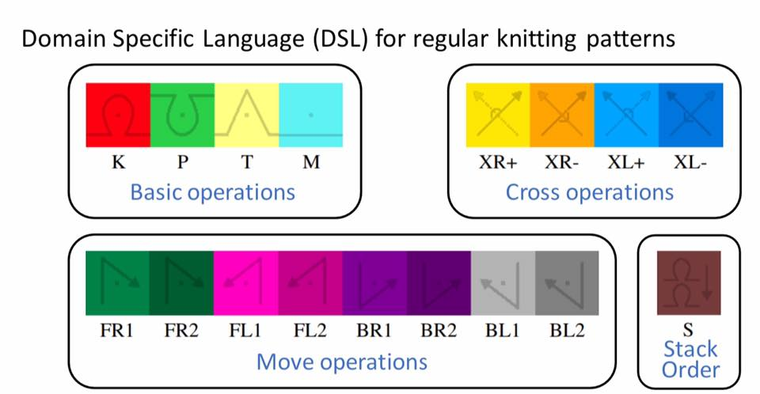
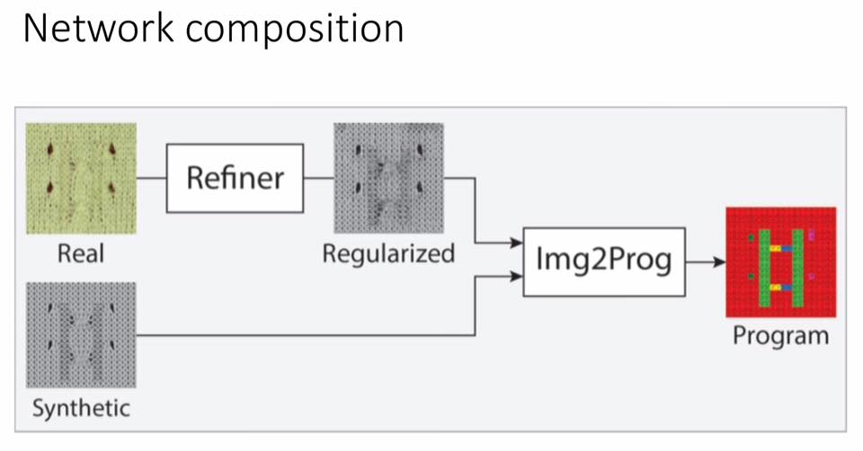

# MIT-CSAIL-computer-aided-knitting-system

Artificial Intelligence takes FASHION DESIGNING to next level with MIT CSAIL computer-aided knitting system which can automate the design and manufacture of knitted garments. 

With this, anyone, even novices, make their own clothes.

Read more at https://arxiv.org/pdf/1904.05681.pdf
